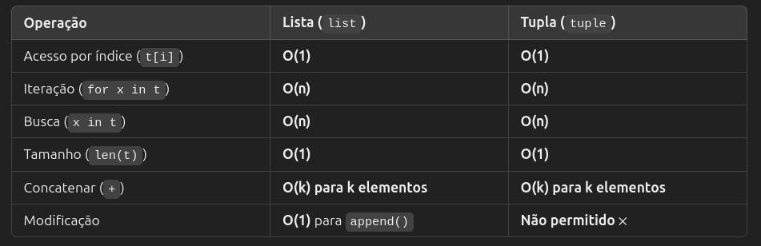
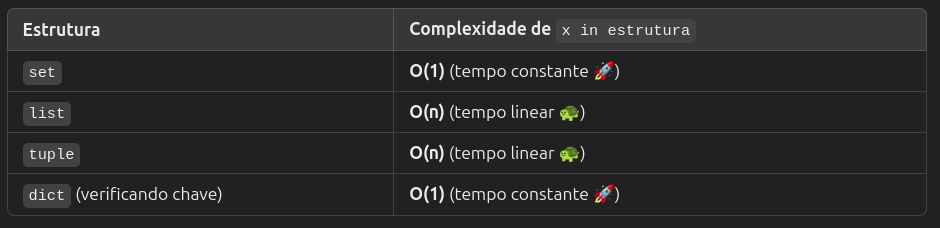

# Listas
- Array: Coleção ordenada de dados
- Armazena dados em sequência, cada um com sua posição (índice)
- Primeiro elemento = índice zero
- Pode armazenar qualquer tipo de dado primitivo, incluindo diferentes tipos na mesma lista
- CARO: inserir ou excluir elemento do início da lista, pois todos os elementos precisam ser deslocados
- CARO no caso de memória pré-alocada cheia: incluir ou excluir elementos no fim da lista


# Dicionários
- Coleção não ordenada de valores usada para armazená-los como mapa (key:value)
- A indexação é feita com a ajuda das chaves
- Hash table: estrutura de dados que armazena pares chave-valor
- Permite acesso rápido aos valores através da função de hash

## Como funciona uma Hash Table
1. Ao inserir um valor no dicionário, Python usa função de hash para transformar a chave em um número (índice onde valor será armazenado)
2. O índice é usado para acessar o valor diretamente, sem percorrer toda a estrutura
3. Como o acesso é direto, a busca é muito rápida: O(1)

## Notação Big-O
- Mede eficiência de algoritmos em relação ao número de elementos manipulados
- O(1) = tempo constante. Significa que a operação leva o mesmo tempo, independente do tamanho da estrutura de dados
- O(n) = tempo linear. Significa que a operação leva mais tempo à medida que a estrutura cresce.

# Tuplas
- Estrutura de dados imutável, ordenada e indexada que pode conter elementos de tipos diferentes.
- Similar a lista, mas é **imutável** = elementos não podem ser adicinados ou removidos
    - Consome menos memória (alocação otimizada)
    - Mais rápidas - não precisam lidar com operações dinâmicas como `append`
- Pode conter elementos repetidos

## Complexidade de Operações



## Casos de uso:
- Dados que não devem ser modificados, como coordenadas geográficas

```python
lat_long = (37.7749, -122.4194)
```

- Retornar estatísticas de uma lista
```python
def estatisticas(numeros):
    return (min(numeros), max(numeros), sum(numeros) / len(numeros))

resultado = estatisticas([10, 20, 30])
print(resultado)  # Saída: (10, 30, 20.0)

```

- Desempacotamento de valores

```python
dados = ("Lara", 27, "Engenharia")
nome, idade, curso = dados
print(nome)  # Saída: "Lara"
```

# Set
- Conjunto de dados desordenado, mutável e de elementos únicos
- Usos:
    - Membershipt testing (se elemento está presente em uma coleção)
    - Eliminar entradas duplicadas
- É eficiente para membership testing pq é baseada em hash tables, permitindo verificação em O(1). Comparação com demais estruturas:



- O CPython usa dicionários para implementar sets - usa chaves para armazenar valores, mas os valores são **dummy** (vazios). O que importa é apenas a chave em si!

```python
meu_set = {1, 2, 3}
# Internamente, isso pode ser representado como:
# {1: None, 2: None, 3: None}
```

- Colisões: dois elementos com o mesmo índice (gerado pela função de hash)
- Nesses casos, CPython adiciona o valor àquela posição, transformando a estrutura em uma Linked List
- Isso é feito de forma eficiente e otimizada, minimizando o impacto da colisão nas operações de busca


# Frozen Set
- Imutável 
- Não aceita alteração após criação

# String 
- Array de bytes representando caracteres Unicode
- Array imutável de caracteres
- Como são imutáveis, modificar uma string resulta em criar uma nova cópia

# Bytearray
- Estrutura mutável que representa uma sequência de bytes.
- Cada elemento é um número inteiro no intervalo 0 <= x < 256 (o que corresponde a um byte)
- Eficiente: Usa menos memória e é mais rápido que listas de inteiros
- Útil para manipulação de binários - arquivos, buffers, criptografia, compressão e redes
- `bytes` é a versão imutável do `bytearray`

## Bytearray a partir de uma lista de inteiros

```python
b = bytearray([65, 66, 67, 68])  # Representa os caracteres ASCII 'ABCD'
print(b)  # Saída: bytearray(b'ABCD')
```

## Bytearray a partir de uma string codificada (UTF-8, ASCII, etc.)

```python
b = bytearray("Olá", "utf-8")  
print(b)  # Saída: bytearray(b'Ol\xc3\xa1')
```

## Casos de uso
- Manipulação de arquivos binários: imagens, áudio, compressão de dados
- Comunicação via rede: protocolos que exigem pacotes binários
- Criptografia: modificação de dados sem criar novas cópias desnecessárias
- Buffers de entrada e saída: Trabalhar com fluxos de dados em sockets

### Exemplo: Modificando um arquivo binário
```python
with open("imagem.jpg", "rb") as f:
    dados = bytearray(f.read())  # Lê os bytes do arquivo e os armazena no bytearray

# Modificar os bytes (exemplo: inverter os 100 primeiros bytes)
dados[:100] = reversed(dados[:100])

with open("imagem_modificada.jpg", "wb") as f:
    f.write(dados)  # Salva as alterações

```