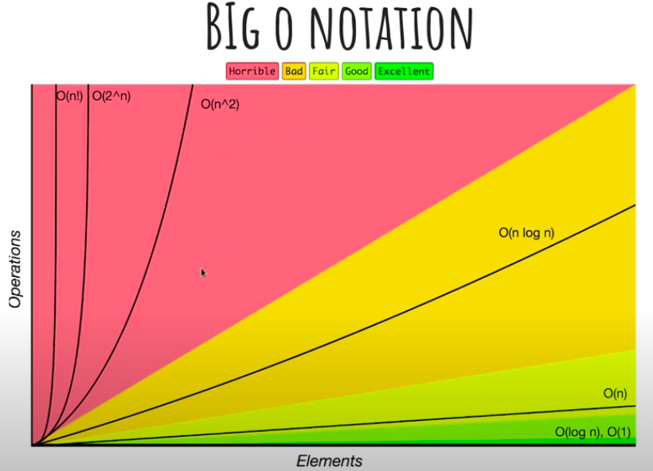
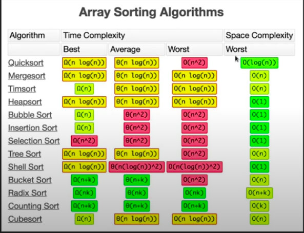
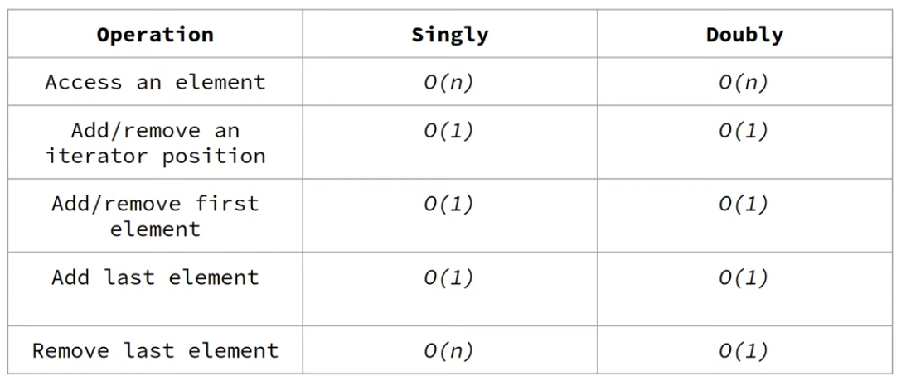

# Estrutura de Dados

- Bloco fundamental da ciência da computação e engenharia de software
- Definição: É um modo particular de armazenamento e organização de dados em um computador para que possam ser utilizados de maneira eficiente.

# Algoritmo

- Definição: Sequência finita de regras, raciocínios ou operação que aplicado a um conjunto de dados permite solucionar uma determinada classe de problemas. (receita de bolo)

- Livros:
    - Introduction to Algorithms - Thomas H. Cormen
    - Cracking the code interview - Gayle Laakman McDowell

## Big O

- Modo de classificar o algoritmo pelo tempo de execução ou espaço ocupado conforme o input aumenta.

## Liked list - Lista encadeada

- Arrays: O(1) | Estão um do lado do outro na memória
- Desvantagem: Mover um valor em um índice para outra posição O(n)
- Lista encadeada: Organizar dados em ordem definida pela estrutura de dados (não linear na memória)
    - O último nó aponta para valor null
    - Singly linked list: 
    - Doubly linked list: Cada nó sabe o próximo nó e o anterior (conseguimos remover o último índice da lista de maneira muito mais fácil)

## Bubble Sort

- Um dos mais fáceis de entender e menos eficientes
- Atuação local: Não gera uma nova lista - Altera localmente
- O maior elemento sobe "como uma bolha" para a maior posição
- Percorre a lista par a par, avaliando se um é menor que o outro. Se o elemento da frente for menor que o anterior => SWAP
- Big O:
    - Melhor caso: Lista já ordenada -> O(n) | Percorrer a lista uma vez
    - Caso médio e pior caso: O(n)²
- O melhor resultado que se consegue obter com algoritmos de ordenação é O(n log n)

## Selection Sort

## Insertion Sort

## Bynary Search

## Merge Sort

## Quick Sort